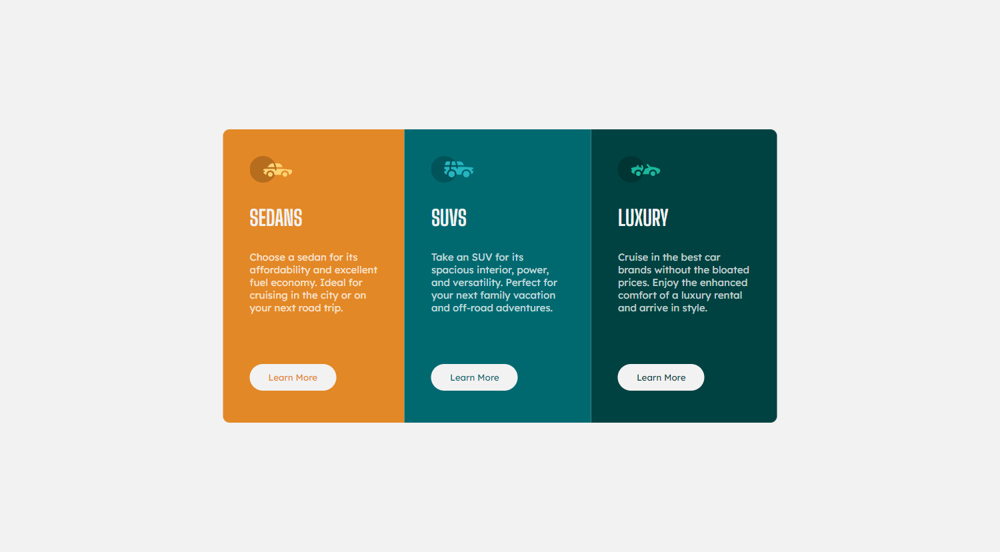

# Frontend Mentor - 3 Column Preview Card Component

This is a solution to the [3 Column Preview Card Component on Frontend Mentor](https://www.frontendmentor.io/challenges/qr-code-component-iux_sIO_H). Frontend Mentor challenges help you improve your coding skills by building realistic projects.

## Table of contents

- [Overview](#overview)
  - [The challenge](#the-challenge)
  - [Screenshot](#screenshot)
  - [Links](#links)
- [My process](#my-process)
  - [Built with](#built-with)
  - [What I learned](#what-i-learned)
- [Author](#author)

### The challenge

Users should be able to:

- View the optimal layout depending on their device's screen size
- See hover states for interactive elements

### Screenshot

### Links

- Live [link](https://nikolam4.github.io/Frontend-Mentor/3%20Column%20Preview%20Card%20Component)

## My process

### Built with

- Semantic HTML5 markup
- CSS custom properties
- Flexbox

### What I learned

I learned to do better vertically alignment of div.

## Author

- Frontend Mentor - [@NikolaM4](https://www.frontendmentor.io/profile/NikolaM4)
- Twitter - [@nikolaa_m4](https://twitter.com/nikolaa_m4)
