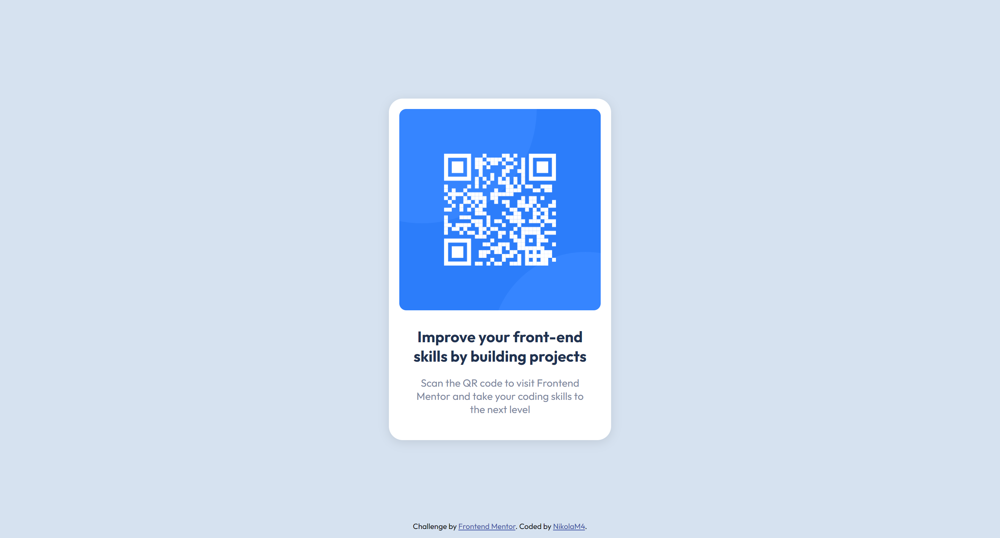

# Frontend Mentor - QR code component solution

This is a solution to the [QR code component challenge on Frontend Mentor](https://www.frontendmentor.io/challenges/qr-code-component-iux_sIO_H). Frontend Mentor challenges help you improve your coding skills by building realistic projects.

## Table of contents

- [Overview](#overview)
  - [Screenshot](#screenshot)
- [My process](#my-process)
  - [Built with](#built-with)
  - [What I learned](#what-i-learned)
  - [Continued development](#continued-development)
- [Author](#author)
- [Acknowledgments](#acknowledgments)

## Overview

### Screenshot

## My process

- Checked README.md file and style-guide.md
- Created styles.css and connected it to index.html
- Make changes at HTML file and add all needed elements and text
- Styled everything with plain CSS

### Built with

- Semantic HTML5 markup
- CSS custom properties

### What I learned

This is one of the easiest projects on Frontend Mentor, so I just spent a couple mintutes trying to make it same as on the provided image without real design where I could check actaul properties.

### Continued development

I would like to write better CSS in the future examples. This was very small project so I didn't want tu use Sass or anything similar.

## Author

- Frontend Mentor - [@NikolaM4](NikolaM4)
- Twitter - [@nikolaa_m4](https://twitter.com/nikolaa_m4)

## Acknowledgments

This is just the beginning. There are many more challanges to come.
